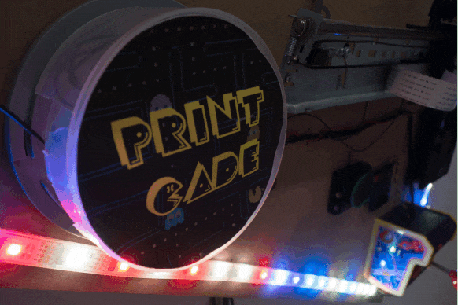

# PrintCade
All the way from Art Hack Day / transmediale, it's PrintCaaaaaaaade!

A discarded printer is reanimated into an arcade game, 80s style!

By [Jonah Brucker-Cohen](http://www.coin-operated.com/) and [Michael Ang](https://www.michaelang.com/) for Art Hack Day at transmediale in Berlin, and World Maker Faire in NYC.

https://www.michaelang.com/project/printcade

http://www.coin-operated.com/2014/01/30/printcade-2014/
